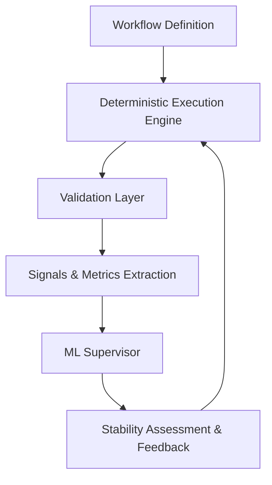

# Invariant: A Control-Theoretic Meta-Learning Framework for Robotics Workflow Analysis

  
  

## What This Is

Invariant is a research framework for analyzing the stability, correctness, and failure modes of robotics software workflows as systems, not as isolated components.

Most robotics stacks fail between modules, at the integration, timing, and orchestration layer. Invariant treats the entire workflow as a dynamic system, instruments it, perturbs it deterministically, and measures how it behaves under stress.

It does not control hardware, plan trajectories, or simulate physics. It exists specifically to answer one question:

> Is this robotics software stack actually stable when it runs as a system?

## Why This Exists

Robotics research has plenty of excellent tools for perception, planning, and control. What is missing is a rigorous way to evaluate how these modules behave when connected in a full pipeline. Integration bugs, timing drift, and cascading failures often appear late in development or only during real hardware runs. Detecting them early is hard and often ad hoc.

Existing literature confirms that research on robotic and autonomous systems (RAS) is wide‑ranging, but there is **limited systematic evidence of rigorous, domain‑agnostic validation techniques that work across software workflows**. A recent systematic review of testing, validation, and verification in RAS found that even though thousands of studies were screened, *very few provide rigorous performance or adequacy measures*, and most still rely on domain‑specific tools rather than general frameworks for software‑level evaluation. :contentReference[oaicite:0]{index=0}

The review also highlights that a broad set of modeling techniques (e.g., temporal logic, state machines, epistemic models) are used to describe requirements and behavior in robotics systems, but there is a gap in **widely accepted, rigorous performance and adequacy metrics** for these models—especially for workflows that involve timing, correctness, and compositional guarantees. :contentReference[oaicite:1]{index=1}

Invariant was designed to fill this gap. By representing workflows as explicit graphs and executing them deterministically, it allows systematic measurement of stability, divergence, and failure sensitivity. This lets you identify weaknesses, test recovery strategies, and collect data that can inform future designs. It’s not just about catching errors; it’s about understanding the behavior of the entire system and creating workflows that are robust, predictable, and research‑ready.

Using Invariant, you can run repeatable experiments that are suitable for publications, internal validation, or building more reliable robotics software. It makes the invisible software‑level dynamics visible.

## Design Philosophy

Invariant is intentionally focused. Every feature it does not implement is a deliberate choice. The goal is to isolate software-level behavior so that the results are clear and actionable.

It does not control motors, compute trajectories, or run perception models. It does not simulate physics. By removing these layers, we can focus on the timing, structure, and logical behavior of the workflow itself. This makes it possible to study fault propagation, stability, and divergence without interference from hardware noise or model inaccuracies.

The systematic review in the literature shows that while many robotic testing techniques exist, **only a minority attempt to characterize efficiency or adequacy in a generalizable way**, and even fewer demonstrate tools that scale across systems and domains (Araujo et al., 2023).

This approach is minimal but powerful. It treats workflows as systems to be measured and understood, rather than just code to be executed. Every decision in Invariant is meant to give researchers and engineers confidence that the metrics and insights it produces reflect the true dynamics of their software.

## Architecture

## Reference(s)

H. Araujo, M. R. Mousavi, and M. Varshosaz, "Testing, Validation, and Verification of Robotic and Autonomous Systems: A Systematic Review," *ACM Transactions on Software Engineering and Methodology*, vol. 32, no. 2, pp. 51:1–51:61, 2023. [DOI: 10.1145/3542945](https://doi.org/10.1145/3542945)
