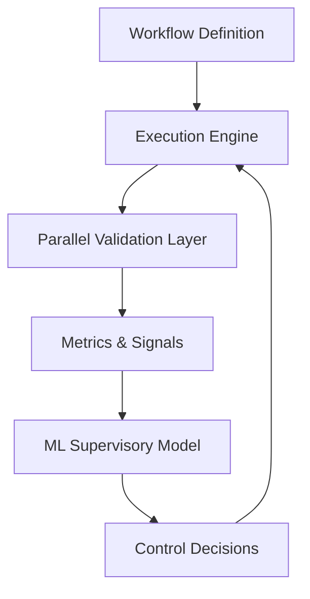
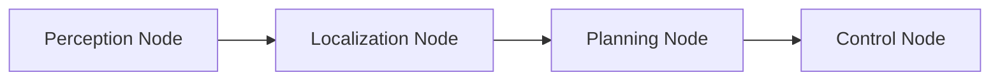
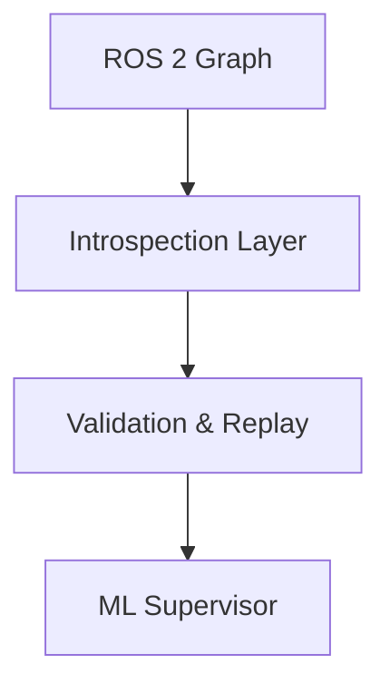

# Invariant

## Overview

Invariant is a research-driven framework that applies principles from robotics control theory to the **design, execution, and validation of robotics software workflows**. Rather than learning robot actions or replacing planners and controllers, this system focuses on *governing* how robotics pipelines behave under uncertainty, timing constraints, and variation.

The core idea is simple but underexplored: 

Robotics systems fail more often due to integration, timing, and validation issues than due to insufficient intelligence. This framework uses machine learning as a *supervisory control layer* to reason about workflow stability, correctness, and reliability.

The project is designed to run entirely on a single development machine, without requiring physical robots or simulators, while remaining compatible with real robotics stacks such as ROS 2.

---

## What This Project Is, and Is Not

### This project **is**:

* A validation and governance layer for robotics workflows
* Inspired by control theory, not end-to-end policy learning
* Focused on reproducibility, determinism, and failure analysis
* Compatible with ROS 2 graphs, bags, and execution models
* Designed for robotics engineers, not abstract ML benchmarks

### This project **is not**:

* A robot motion controller
* A reinforcement learning policy
* A simulator or physics engine
* A perception or planning model
* A low-code abstraction that hides system details

Machine learning is used here as a meta-level system intelligence, not as a replacement for robotics level logic.

---

## The motivation for this project

In modern robotics, validation is typically ad hoc, sequential, manual, and difficult to reproduce. It is often performed late in development, tightly coupled to specific hardware or simulator configurations, and driven by trial and error rather than formal reasoning. As robotics systems grow in scale, this style of validation provides little insight into system-level behavior and makes it difficult to understand how errors propagate across nodes, time, and feedback loops.

This project takes a different approach by treating the robotics workflow itself as a dynamic system. Rather than validating individual components in isolation, the entire software graph is modeled as an evolving system with state, inputs, outputs, and internal feedback. Timing, data flow, and execution order are treated as first-class signals, not side effects.

By applying control-theoretic ideas such as observability, stability, perturbation response, and closed-loop analysis, workflows can be systematically analyzed, stressed, replayed, and stabilized in a controlled and reproducible environment. This enables validation to move from a one-off, hardware-dependent process to a repeatable exploration of a workflow’s operating envelope without requiring physical robots or simulators.

---

## Invariant's System Level Architecture

### High-Level Architecture

The system forms a closed feedback loop, analogous to classical control systems.

---

## Workflow Representation

Workflows are represented as structured graphs:

* Nodes represent components (e.g., perception, planning, control)
* Edges represent data or control flow
* Each node emits timing and validation signals

This representation enables both graph-based learning and formal validation.

---

## Machine Learning Model

### Model Role

The ML model learns relationships between:

* Workflow structure
* Temporal behavior
* Validation outcomes

and predicts:

* Probability of failure
* Sensitivity to perturbations
* Likely failure classes
* Confidence and stability scores

### Model Characteristics

* Graph-aware (e.g., GNN-style message passing)
* Temporal reasoning over execution windows
* Trained on synthetic and replayed workflows
* No action or control outputs by design

This ensures the model remains a *governor*, not an actor.

---

## Validation Modes

### Structural Validation

* Graph topology consistency
* Topic and interface compatibility
* Contract enforcement

### Temporal Validation

* Latency budgets
* End-to-end timing
* Jitter and variance detection

### Behavioral Validation

* Divergence across replayed runs
* Sensitivity to noise and delays
* Stability under controlled perturbations

---

## ROS 2 Integration

The framework integrates with ROS 2 non-invasively:

* Introspects node graphs
* Subscribes to live or bagged data
* Mirrors execution without interfering

No modifications to existing ROS 2 nodes are required.

---

## Status

This project is under active R&D. The current focus is on:

* Abstract workflow modeling
* Parallel validation infrastructure
* Machine learning based stability and failure prediction

Hardware integration has been intentionally deferred.
